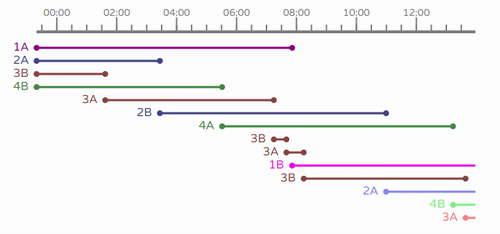

# timeline.js

A JavaScript module to show multiple durations with a label below a horizontal timescale.



```timeline.js``` was created to visualize the use of pump inlets on a production line over time. 

Data was shown in a table view and it was hard to identify start, end, overlapping, gaps and more. So this graphical representation makes it way more easier to understand what is going on.

Because there where certain requirements regarding the way the usage of the pump inlets had to be displayed this small JavaScript module was created to visualize this data.

# Requirements
* A web browser with support for [SVG](https://en.wikipedia.org/wiki/Scalable_Vector_Graphics) graphics.

```timeline.js``` is a standalone JavaScript module. No other libraries are required.

# How to Install
* Either clone the repository or download the zip file.
* Copy the file ```timeline.js``` from the ```lib``` directory to a directory on your web server.

# How to Use
Here is a brief explanation how to use the module.

## Include the javascript file on your web page
Include the JavaScript file on your web page. In the example below the file resides in a subdirectory named ```js```.
```javascript  
    <script src="js/timeline.js"></script>
```
## Add a container element to your web page
Add a container element to your web page. The module will output the svg graphics into this container. ```timeline.js``` will fill the full width of the container. The height will be automatically set by the amount of data items.

```javascript  
    <div id="container"></div>
```

__Hint:__ If you use a DIV element as the container it will fill the whole width of the parent. Otherwise you may have to set the desired width and height of the container manually.

## Create a timeline object
Add JavaScript code to create a timeline object.

```javascript
var timeline = Timeline(
  document.getElementById('container'), 
  {
    startDateTime: '2018-04-17 00:00:00',
    endDateTime: '2018-04-18 00:00:00',
  }
);
```


## Set data to display
Add JavaScript code to set the data to be displayed.

```javascript
timeline.setData([
  { label: 'P1', start: '2018-04-16 22:34:00', end: '2018-04-17 02:48:37' },
  { label: 'P2', start: '2018-04-17 06:06:43', end: null },
  { label: 'P3', start: '2018-04-17 14:00:43', end: '2018-04-17 15:00:00' },
  { label: 'P4', start: '2018-04-17 11:56:02', end: '2018-04-17 19:34:41' }
]);
```


## Full working example
Here is a minimal, full working example.

```html
<html>
  <head>
    <title>Minimal Timeline Example</title>
    <script src="timeline.js"></script>    
  </head>
  <body>
    <h1>Minimal Timeline Example</h1>

    <div id="container"></div>

    <script>

      // Initialize the timeline instance
      var tl1 = Timeline(
        document.getElementById('container'), 
        {
          startDateTime: '2018-04-17 00:00:00',
          endDateTime: '2018-04-18 00:00:00',
        }
      );

      tl1.setData([
        { label: 'P1', start: '2018-04-16 22:34:00', end: '2018-04-17 02:48:37' },
        { label: 'P2', start: '2018-04-17 06:06:43', end: null },
        { label: 'P3', start: '2018-04-17 14:00:43', end: '2018-04-17 15:00:00' },
        { label: 'P4', start: '2018-04-17 11:56:02', end: '2018-04-17 19:34:41' }
      ]);

    </script>
  </body>
</html>
```


# Examples
You can find some basic examples in the ```examples``` directory.

* [minimal.html](examples/minimal.html)
* [colorfull.html](examples/colorfull.html)
* [live-update.html](examples/live-update.html)

# Timeline options
When creating the timeline object you can set various options. Here is a list of available options and a brief description.

| Option name          | Datatype   | Default     | Description           |
| -------------------- | :--------: | :---------: | --------------------- |
| debug                | bool       | false       | If set to __true__ ```timeline.js``` will output additional debug information on the browser console. |
| marginLeft           | number     | 50          | Left distance between svg border and data view. |
| marginRight          | number     | 50          | Right distance between svg border and data view. |
| marginTop            | number     | 20          | Top distance between svg border and data view. |
| marginBottom         | number     | 10          | Bottom distance between svg border and data view. |
| scaleFillFactor      | number     | 0.5         | Maximum density of the labels (major ticks) on the horizontal scale. 0.5 means 50% filling. If you want more labels increase the number. If you want less labels decrease the number. |
| scaleFormat          | string     | hh:mm       | Display format for the labels on the timescale. Supported format specifiers: s, ss, m, mm, h, hh, D, DD, M, MM, YY, YYYY |
| scaleFontSize        | string     | 12pt        | Size of the scale font. |
| scaleColor           | string     | #808080     | Color of the scale. |
| scaleWidth           | number     | 4           | Line width of the scale. |
| scaleMajorTickLength | number     | 20          | Length of the major ticks on the scale. |
| scaleMinorTickLength | number     | 10          | Length of the minor ticks on the scale. |
| scaleBottomMargin    | number     | 20          | Margin below the scale, before data items begin. |
| minorTicks           | number     | null        | Duration in seconds for the major ticks step width. null = best fit automatically. |
| majorTicks           | number     | null        | Duration in seconds for the minor ticks step width. null = best fit automatically. |
| dataColor            | string     | #008000     | Color of the data items label, line and bullet. |
| dataWidth            | number     | 3           | Width of the data items line. |
| dataBulletRadius     | number     | 4           | Radius for the data items bullet. |
| dataOffset           | number     | 5           | Space between start of the data items line and the label. |
| dataFontSize         | string     | 16pt        | Size of the data items label. |
| dataLineHeight       | number     | null        | Height of a data row in pixels. null = auto height, depending on the chosen ``dataFontSize``. |
| mapDataItem          | function   | _[default]_ | Callback function to map data items to internal objects. Sometimes it is handy not to prepare an extra array of data for the timeline object. It may be easier to convert the already available data on the fly. Set this callback to a user defined function to map any array items you set using the ``setData()`` function to the required object for ```timeline.js```.  |

# Timeline methods
After creating the timeline object you can use public methods to control the behaviour of the object.

## refresh()
Use the  `refresh()` method to render the objects content.

```javascript
timeline.refresh();
```
__Note__: ```timeline.js``` itself does not care for resizing. So if you want to fit the content after the browser window has been resized you need to hook to the event on your own and call the `refresh()` method.

## setData()
Use the `setData()`method to set the data items the ```timeline``` object will show.

```javascript
timeline.setData([
  { label: 'P1', start: '2018-04-16 22:34:00', end: '2018-04-17 02:48:37' },
  { label: 'P2', start: '2018-04-17 06:06:43', end: null },
  { label: 'P3', start: '2018-04-17 14:00:43', end: '2018-04-17 15:00:00' },
  { label: 'P4', start: '2018-04-17 11:56:02', end: '2018-04-17 19:34:41' }
]);
```

__Note__: If your data items have different properties than the ones required by ```timeline.js``` (`label`, `start`, `end`) you can use the `mapDataItem`-option to convert your item objects into timeline data objects - on the fly.


## setPeriod()
Use the `setPeriod()`method to set the range of time ```timeline.js``` will show.

```javascript
timeline.setPeriod('2018-04-16 00:0:00', '2018-04-17 00:00:00');
```

# Data item object properties
When you set data using the `setData()` method your items need to have the required properties below:

| Property             | Datatype      |  Example               | Description           |
| -------------------- | :-----------: |  --------------------- | --------------------- |
| label                | string        |  'A1'                  | The label of the data duration. |
| start                | string \| Date |  '1971-11-04 14:00:00' | The start datetime of the duration. |
| end                  | string \| Date |  '1971-11-04 16:00:00' | The end datetime of the duration. If set to `null` then the duration is 'still running' and the finishing-bullet will not be drawn. |
| _color_              | string        |  '#ffaa80'             | Optional. The color of the label, line and bullets. |


# License
```timeline.js``` is published under [MIT](LICENSE) license.
